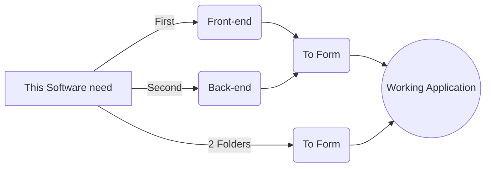

# Explanation :
One fine day, I thought let's play with `CRUD Operation`, Now please don't consider me PRO because of this reason ;)  
> CRUD is basically `Create`, `Read`, `Update`, `Delete`. These are basic operations that we play with Data. I mean it is actually interesting to build something that is working. Feels like an Engineer but `UnEmployed:)`

Now, Just take a quick look on how things are working in this piece of shit.

## What is Frontend and Backend :
 So, here is a very famous example to understand what is front-end and back-end copied from Chat-GPT.  `Because, I am too lazy to write it.`
 
 > The **frontend** is like the **skin** of a human body. It's what you see and interact with directly. In the context of a website or app, this includes everything you see on the screen—the buttons, text, images, and overall layout.
It's built with technologies like `HTML`, `CSS`, `React`, `Tailwind`  and `JavaScript`.

and 

> The **backend** is like the **skeleton** inside your body. It's not visible, but it supports everything and makes sure the body functions properly. In the context of a website or app, the backend handles the logic, data storage, and everything that happens behind the scenes.

When both the frontend and backend work together, you get a functional and full-stack application.   

so, coming back to folder, the above structure is of a `Blog Website`.  The folder `my-blog` contains `front-end` also know as `client` and folder `blog-backend` contains `back-end` also known as `server`.

## Table of contents :
1. [Frontend](#frontend)
2. [Backend](#backend)
